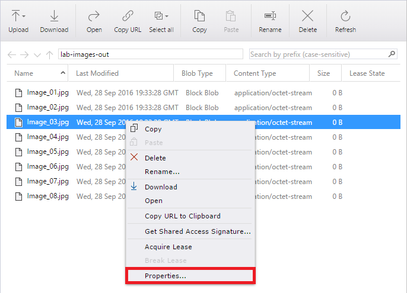
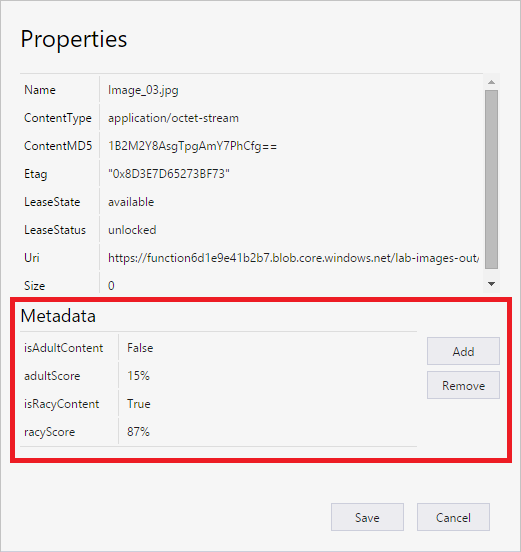

    _Opening the "lab-images-out" container_

1. Right-click (on a Mac, Command-click) one of the images in the "lab-images-out" container and select **Properties** from the context menu.

    

    _Viewing blob metadata_

1.	Inspect the blob's metadata. *IsAdultContent* and *isRacyContent* are Boolean values that indicate whether the Computer Vision API detecting adult or racy content in the image. *adultScore* and *racyScore* indicate the computed probabilities. Check these values for other images in the "lab-images-out" container to see how they vary.

    

    _Metadata added by your Azure Function_

You can probably imagine how this might be used in the real world. Suppose you were building a photo-sharing site and wanted to prevent adult images from being stored. You could easily write an Azure Function that inspects each image that is uploaded and deletes it from storage if it contains adult content.

## Summary ##

In this hands-on lab you learned how to:

- Create an Azure Function App
- Write an Azure Function
- Configure an Azure Function with a blob trigger
- Configure app settings for an Azure Function App
- Process incoming, outgoing, and bidirectional values from a trigger
- Use Microsoft Cognitive Services to analyze images and store the results in blob metadata

This is just one example of how you can leverage Azure Functions to automate repetitive tasks. Experiment with other Azure Function templates to learn more about Azure Functions and to identify additional ways in which they can aid your research or business.

---

Copyright 2016 Microsoft Corporation. All rights reserved. Except where otherwise noted, these materials are licensed under the terms of the MIT License. You may use them according to the license as is most appropriate for your project. The terms of this license can be found at https://opensource.org/licenses/MIT.