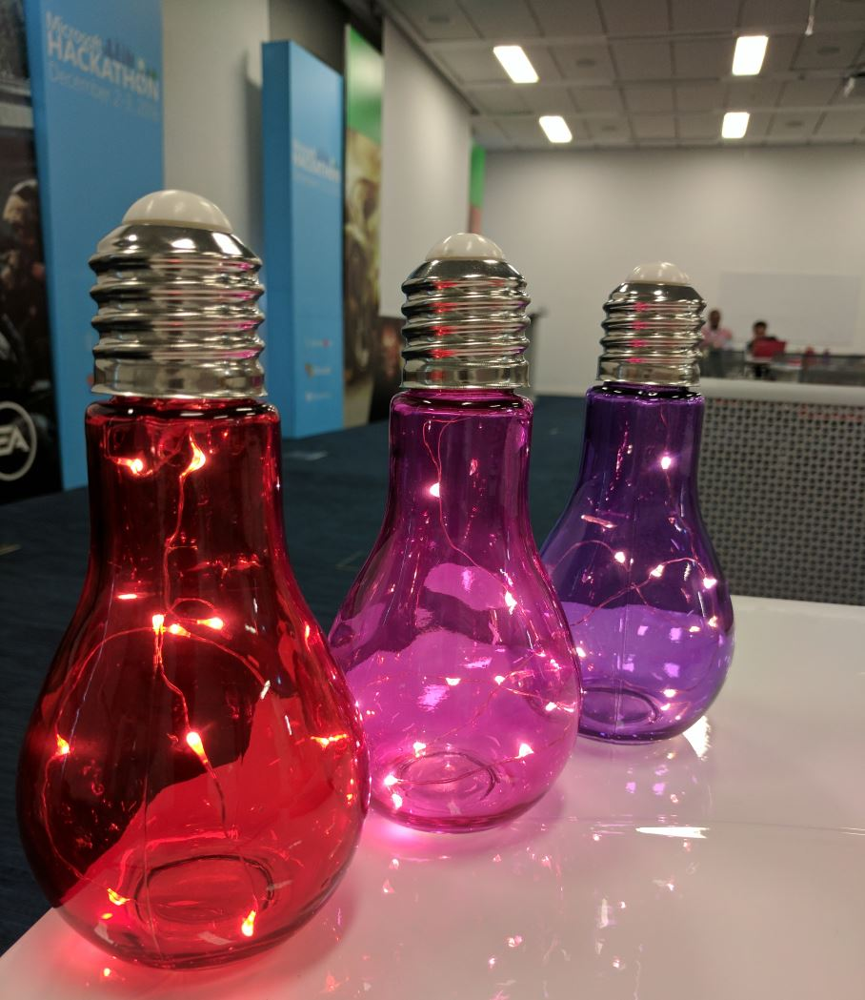

# Azure App Services Hackathon for Saudi ISVs #

Welcome to #AppServicesHackathon where we are going to work for the next 48 hours to solve real issues from your working environment using Azure App Services, specially Azure Functions and Azure Web Apps. These are the criteria you should follow:

1- Chose a real case scenario from your business,  a problem you already have or a new feature that can be implemented in one of your products.

2- Use Azure Functions or/and Azure Web Apps to be the main component of your solution.

3- You still can use any other Azure or non-Azure technology. Feel free to innovate and integrate with any other service (i.e: Cognitive Services, PowerBI Embeded, Bots .. etc)

4- That's all, prepare your project to be presented at 3:30 PM the 2nd day of the hackathon. You have 10 mins to present.

## Samples and HOL for Azure Functions ##

You can find the [Hands-on Lab](https://github.com/nasserDev/AppServicesHackathon/tree/master/HOL%202)  we started this hackathon with in addition to [another Hands On Lab you can check and practice] (https://github.com/nasserDev/AppServicesHackathon/blob/master/HOL2/README.md). Also have a look at [some code samples] (https://github.com/nasserDev/AppServicesHackathon/tree/master/Samples) we prepared to be utilized in Azure Functions. Feel free to utilize these resources in your project.

### Documentation

 - [Azure Functions Overview](https://azure.microsoft.com/en-us/documentation/articles/functions-overview/)
 - [Azure Functions Concepts](https://azure.microsoft.com/en-us/documentation/articles/functions-reference/)
 - [Azure Functions C# developer reference](https://azure.microsoft.com/en-us/documentation/articles/functions-reference-csharp/)
 - [Azure Functions Node.js developer reference](https://azure.microsoft.com/en-us/documentation/articles/functions-reference-node/)
 - [Azure Functions bindings & triggers](https://azure.microsoft.com/en-us/documentation/articles/functions-triggers-bindings/)
 - [Azure Functions getting started](https://azure.microsoft.com/en-us/documentation/articles/functions-create-first-azure-function/)
 - [Azure Functions sample: webhooks](https://azure.microsoft.com/en-us/documentation/articles/functions-create-a-web-hook-or-api-function/)
 - [Azure Functions sample: event processing](https://azure.microsoft.com/en-us/documentation/articles/functions-create-an-event-processing-function/)
 - [Azure Functions sample: azure services](https://azure.microsoft.com/en-us/documentation/articles/functions-create-an-azure-connected-function/)
 - [Testing an Azure Function](https://azure.microsoft.com/en-us/documentation/articles/functions-test-a-function/)
 - [Scaling a Function](https://azure.microsoft.com/en-us/documentation/articles/functions-scale/)
 - [Building the Azure Functions runtime locally](https://github.com/Azure/azure-webjobs-sdk-script/wiki)
 
### Samples
 - [List of samples](https://github.com/Azure/AzureFunctions/wiki/Samples)
 - [List of blogs](https://github.com/Azure/AzureFunctions/wiki/Blogs)

## Need Help ? ##

If you need any help, press any of the bulbs on your table :)

The technical mentors team are:

1. **Nasser AlNasser** - Senior Technical Evangelist.

2. **Sayed Ali** - Senior Premier Field Engineer.

3. **Mohamed Ossama** - Technical Solution Professional.

4. **Tarek Al-Laham** - Technical Solution Professional.   

## Submit Your Project ##

If your project doesn't contain sensitive data about your business and you would like to share it with the rest, you can send it to Nasser AlNasser : nnasser -at- outlook -dot- com or publish it yourself to this repo and projects folder.

